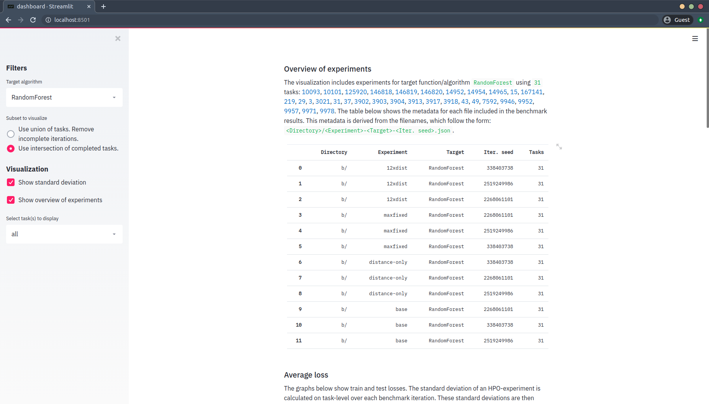
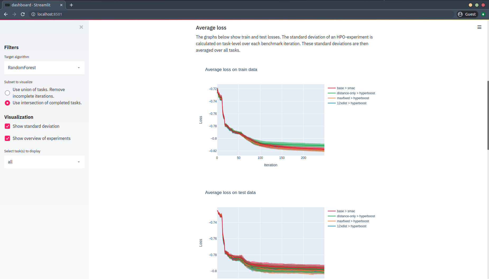

# Hyperboost

## Setup
Make sure that SWIG and Python-dev are installed:
```
$ apt install swig python3-dev
```


## Benchmark

**How are the benchmarks executed?**

- Every experiment is repeated 3 times per dataset. 
    - With each repitition, we set the seed of the HPO algorithm, so that it produces reproducible results.
- We use 3 outer-folds and we execute the HPO loop once per fold.
    - 2/3th training data for HPO algorithm, 1/3th testing data for validating resulting model.
    - Resulting model is retrained on the training data and its performance is then validated on the test data.
    - Retraining and validation is repeated 3 times for non-determistic algorithms and results are aggregated.
    - In order to visualize a trajectory, we do this retraining and validation every time the HPO algorithm decides on a new best configuration. 
- We use 3 inner-folds to try each configuration.
    - We create 3 shuffled copies and split each copy into 90% training data and 10% test data.
    - We keep these splits the same for every configuration we try.
    
Other configurations can be found in `benchmark/config.py`.

**What datasets are included?**    
Currently there are 31 datasets included, which is a subset of the OpenML CC18 benchmark suite.
Datasets that were very large are exlcuded from this suite to speed up benchmarking. 
Furthermore, only binary classification datsets were selected such that metrics such as f1-score are easier to compute.
We intend to change this later.


**What is Hyperparameter Optimization (HPO) algorithms are included?**    
The following algorithms are included:
- Hyperboost
- SMAC
- ROAR (x2)
- Randomized (x2)

Here, x2 means that the algorithm is given twice as much time. 
The running time is then divided by 2 after execution. This simulates an algorithm running on two nodes in parallel.

Random Online Agressive Racing (ROAR) is a framework on which SMAC builds.
Instead of using a surrogate model to find interesting samples, here the samples are drawn at random. 
Like SMAC, it includes a racing mechanism to determine how many times to execute a configuration, and decides on when we are confident enough that we have found a new best configuration.   

**Which parameter spaces are included?**   
There are parameter spaces included for Random Forest, Gradient Boosting, Decision Tree, Linear SVM.
These can be found and edited in the `param_spaces.py` file.


**How does the directory structure look?** 

``` 
benchmark/
├── config.py         - Configuration for the benchmark
├── param_spaces.py   - Parameter spaces to include in the benchmark
├── run_benchmark.py  - Execute this file to run the benchmark
└── util.py           - Helper functions for the benchmark
```

**How do I execute a benchmark?**    
If you are working with an IDE, you can just open the project and execute the `run_bencmark.py` file.

**How do I keep track of the progress?**   
There are three ways you could track the progress.

1. Via the dashboard. Make sure to select the option `Use intersection of completed tasks` and tick `show overview of experiments`.
. The dashboard can be activated using:
```bash
streamlit run dashboard.py
```

1. In the `smac_output` folder, you can see the output produced by SMAC. 

2. In the `output.txt` file, we first print the task which the benchmark is running currently, and then the final 
running time, train loss and test loss per HPO method. Example ouput for one task:
    ```text
    Task 125920
    [hyperboost] time=54.26275706291199 train_loss=0.4108852195849099 test_loss=0.46281296023564067
    [smac] time=78.04565906524658 train_loss=0.39024595803233575 test_loss=0.44516445753559153
    [roar_x2] time=9.362297058105469 train_loss=0.4159545923632611 test_loss=0.45324005891016195
    
    [hyperboost] time=159.37080311775208 train_loss=0.3476443355119826 test_loss=0.4543200785468826
    [smac] time=313.60485649108887 train_loss=0.37570806100217863 test_loss=0.445974472263132
    [roar_x2] time=20.471973180770874 train_loss=0.37790032679738567 test_loss=0.4457290132547864
    
    [hyperboost] time=446.10776805877686 train_loss=0.4405289808230985 test_loss=0.40734126984126984
    [smac] time=464.2149374485016 train_loss=0.4331577246283128 test_loss=0.41344246031746035
    [roar_x2] time=51.709378719329834 train_loss=0.44436076994900525 test_loss=0.3999503968253969
    ```  
    Note: this file shows a new paragraph for each of the inner-folds.
3. In the command line interface we print a:
   - `.` when the configuration is ready to be tested
   - `,` to indicate model initialization with this configuration completed
   - `;` to indicate cross validation with this model instance is finished

**Where can I see the results of the benchmark?**   
The output can be seen in `benchmark-{name}-{seed}.json`, which stores the result as:
```
task id > HPO method > [
                          {
                             loss_train: [...],
                             loss_test: [...],
                             total_time: ___,
                             run_time: ___,
                             n_configs: ___
                          },
                          {...},
                          {...}
                       ]
```

**How do I visualize the results?**    
Simply run:
```bash
streamlit run dashboard.py
```
You will see an interactive dashboard with interactive plots (showing loss, ranking, etc.) where you can visualize all experiments executed 
up to this point. Even incomplete experiments can be shown by taking the intersection of tasks that are completed by all experiments
or by removing incomplete benchmark iterations.

